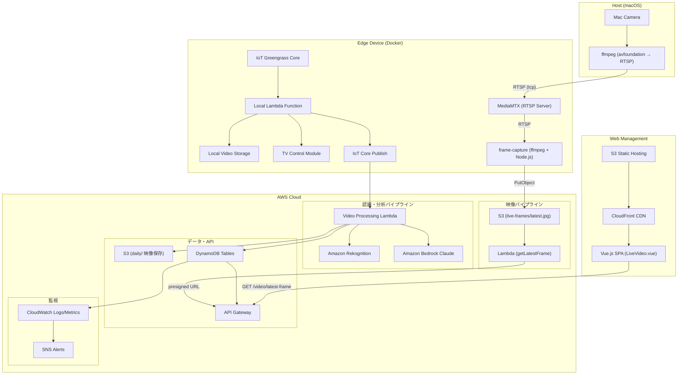

# Design Document

## Overview

NoEatToStopシステムは、エッジコンピューティングとクラウドベースの映像認識を組み合わせたハイブリッドアーキテクチャを採用します。Docker上のIoT Greengrass Coreコンテナでリアルタイム映像処理を行い、IoT Core経由でのデータ通知とAmazon Kinesis Video Streamsを通じてクラウド側の高精度な認識処理と連携します。エッジ処理はDocker上で動作するためマシン非依存（Raspberry Pi、開発PC等）です。

システムは以下の3つの主要コンポーネントで構成されます：
1. **エッジデバイス層**: Docker + IoT Greengrass Core + Local Lambda + カメラ
2. **クラウド処理層**: KVS + Rekognition/Bedrock + Lambda
3. **管理・制御層**: Vue.js SPA + CloudFront + S3

## Architecture

### 全体アーキテクチャ



### ライブ映像フロー（現在の実装）

Mac ではカメラデバイスを Docker に直接パススルーできないため、ffmpeg + MediaMTX (RTSP) 経由でフレームをキャプチャし、S3 + presigned URL で管理画面に配信する。リアルタイムストリーミングではなく、数秒間隔の静止画フレーム更新方式。

```
ライブ映像の動作フロー
=====================

[Host macOS]                   [Docker]                        [AWS Cloud]              [Browser]
     |                              |                               |                       |
     | 1. start-camera.sh           |                               |                       |
     |    ffmpeg avfoundation       |                               |                       |
     |------ RTSP (tcp) ---------->|                               |                       |
     |                     MediaMTX (port 8554)                     |                       |
     |                              |                               |                       |
     |                     frame-capture                            |                       |
     |                      2. ffmpeg -frames:v 1                   |                       |
     |                         (RTSP → JPEG)                        |                       |
     |                              |                               |                       |
     |                              |--- 3. S3 PutObject ---------->|                       |
     |                              |    live-frames/latest.jpg     |                       |
     |                              |         (3秒ごと繰り返し)       |                       |
     |                              |                               |                       |
     |                              |                               |    4. GET /video/     |
     |                              |                               |<--- latest-frame -----|
     |                              |                               |                       |
     |                              |                      Lambda: getLatestFrame            |
     |                              |                      S3 presigned URL生成 (60秒有効)    |
     |                              |                               |                       |
     |                              |                               |--- 5. {url: "..."} -->|
     |                              |                               |                       |
     |                              |                               |    6. GET presigned   |
     |                              |                               |<--- URL (S3直接) -----|
     |                              |                               |                       |
     |                              |                               |--- 7. JPEG 画像 ----->|
     |                              |                               |                       |
     |                              |                               |    8.  表示      |
     |                              |                               |    (liveVideoUpdate   |
     |                              |                               |     Interval秒で      |
     |                              |                               |     4-8を繰り返し)     |
```

### S3 ストレージ構造

```
noeatstop-videos-{stage}-{account}/
├── live-frames/                   ← ライブ映像フレーム (1日で自動削除)
│   └── latest.jpg                 ← 最新フレーム (frame-capture が上書き更新)
└── daily/                         ← 食事セッション映像 (1日で自動削除)
    └── YYYY-MM-DD/
        └── session-{sessionId}/
            ├── raw-video.mp4
            ├── analysis-frames/
            └── metadata.json
```

## Components and Interfaces

### 1. Edge Device Components

#### Camera Module
- **責任**: Mac カメラからの映像取得とクラウドへのフレーム配信
- **技術**: ffmpeg (avfoundation) + MediaMTX (RTSP) + frame-capture (Node.js)
- **仕様**: Mac 内蔵カメラ（640x480/30fps）
- **配信方式**: RTSP → JPEG フレームキャプチャ → S3 アップロード（`CAPTURE_INTERVAL` 秒ごと）
- **構成**:
  - `start-camera.sh` (ホスト): ffmpeg で Mac カメラ → MediaMTX へ RTSP 配信
  - `mediamtx` (Docker): RTSP サーバー（TCP、ポート 8554）
  - `frame-capture` (Docker): RTSP から1フレーム取得 → S3 `live-frames/latest.jpg` にアップロード
- **macOS 制約**: Docker on Mac ではカメラデバイス (`/dev/video0`) を直接パススルーできないため、ホスト側 ffmpeg → RTSP 経由で Docker に映像を渡す
- **エラーハンドリング**: カメラ故障時は処理停止、TV制御も実行しない

#### IoT Greengrass Core (Docker)
- **責任**: エッジデバイスでのローカル処理とクラウド連携
- **技術**: AWS IoT Greengrass v2（Docker コンテナとして起動）
- **実行環境**: docker-compose で管理、マシン非依存
- **機能**:
  - Local Lambda関数の実行環境
  - デバイス証明書による認証
  - IoT Core 経由でのデータ通知（MQTT Publish）
  - クラウドとの双方向通信

#### Local Lambda Function
- **責任**: エッジでの基本的な映像解析と制御判断
- **技術**: TypeScript (Node.js 18)、Docker コンテナ内で実行
- **処理内容**:
  - 顔検出（人の顔認識閾値設定可能）
  - 口の位置検出（口の位置認識閾値設定可能）
  - 咀嚼動作の基本判定（咀嚼判定閾値設定可能）
  - 食事開始判定：食器配置後の食事を口に運ぶ動作
  - 食事終了判定：食器の片付け完了
  - 複数子供対応：設定された子供数分の動作停止検出
  - 大人検出除外：管理画面設定によるON/OFF制御
- **設定可能パラメータ**:
  - 動作停止閾値：デフォルト10秒
  - 信頼度閾値：デフォルト80%
  - 映像バッファ：デフォルト10秒
  - 映像データ：デフォルト20秒間で判定
- **データ通知**: IoT Core 経由で MQTT トピックに状態変化を Publish
  - トピック: `noeatstop/{deviceId}/eating-state`
  - トピック: `noeatstop/{deviceId}/tv-control`
- **インターフェース**:
  ```typescript
  // エッジ処理のメインループ
  async function processFrame(frame: FrameData, config: SystemConfiguration): Promise<void> {
    const analysis = analyzeFrame(frame, config);
    const eatingState = determineEatingState(analysis, config.childCount);

    // TV制御（即座にOFF）
    if (eatingState === 'chewing_stopped_threshold_exceeded') {
      await controlTV('OFF');
    }

    // IoT Core経由でクラウドに状態通知
    await publishToIoTCore('noeatstop/device/eating-state', { state: eatingState, confidence: analysis.confidence });

    // 信頼度が閾値未満の場合はKVSへ映像送信
    if (analysis.confidence < config.confidenceThreshold) {
      await sendToKVS(videoSegment);
    }
  }
  ```

#### TV Control Module
- **責任**: パナソニック製テレビ（2022年製50インチ）の電源制御
- **技術**: Smart TV API優先、Amazon Alexa音声制御も活用
- **制御方式**:
  - Smart TV API: HTTP REST API経由での直接制御
  - Alexa統合: 音声合成による日本語コマンド送信
  - リトライ設定: 1回リトライ、3秒間隔
- **インターフェース**: 
  ```python
  def control_tv(action: str) -> bool:
      # Smart TV API試行
      if smart_tv_api_control(action):
          return True
      
      # Alexa音声制御フォールバック
      return alexa_voice_control(f"テレビを{action}")
  ```

### 2. Cloud Processing Components

#### Kinesis Video Streams
- **責任**: エッジからの映像ストリーミング受信
- **設定**:
  - ストリーム保持期間: 1日（管理画面で設定変更可能）
  - 解像度: デフォルト640x360（管理画面で設定変更可能）
  - フレームレート: 30fps（管理画面で設定変更可能）
- **インターフェース**: KVS Producer SDK (Python)
- **エラーハンドリング**: ネットワーク断絶時はエッジ処理のみで継続

#### Video Processing Lambda
- **責任**: クラウド側での高精度映像解析
- **技術**: Python 3.9, boto3
- **処理フロー**:
  1. KVSからの映像セグメント取得
  2. フレーム抽出（1秒間隔）
  3. Rekognition/Bedrockでの解析
  4. 結果の統合判定
  5. 状態更新とエッジへの指示送信

#### Amazon Rekognition Integration
- **用途**: 基本的な物体・動作検出
- **機能**:
  - 顔検出と表情解析
  - 手の動き検出
  - 食器・食べ物の認識
- **API使用**: `detect_labels`, `detect_faces`, `detect_custom_labels`

#### Amazon Bedrock (Claude) Integration
- **用途**: 複雑な咀嚼行動の詳細解析
- **優先度**: エッジ処理より高精度なクラウド処理を優先
- **機能**:
  - 咀嚼動作の継続時間解析
  - 複数子供の同時監視
  - 大人と子供の識別（設定による除外制御）
  - 誤判定の自動復旧
- **プロンプト例**:
  ```
  この20秒間の映像フレームを分析して、子供の咀嚼状態を判定してください：
  1. 咀嚼中（継続的な口の動き）
  2. 咀嚼停止（10秒以上の動作停止）
  3. 食事終了（食器の片付け）
  
  設定：子供数={child_count}、大人検出除外={exclude_adults}
  判定理由と信頼度も含めて回答してください。
  ```

### 3. Data Management Components

#### DynamoDB Tables
- **MealSessions**: 食事セッション管理
  ```json
  {
    "sessionId": "string",
    "startTime": "timestamp",
    "endTime": "timestamp",
    "status": "active|completed",
    "eatingDuration": "number",
    "pauseCount": "number"
  }
  ```

- **EatingStates**: 食事状態履歴
  ```json
  {
    "sessionId": "string",
    "timestamp": "timestamp",
    "state": "eating|not_eating|ended",
    "confidence": "number",
    "analysisSource": "edge|rekognition|bedrock"
  }
  ```

- **SystemSettings**: システム設定
  ```json
  {
    "settingKey": "string",
    "settingValue": "string",
    "lastUpdated": "timestamp"
  }
  ```

#### S3 Storage Structure
```
noeatstop-videos-{stage}-{account}/       ← 映像用バケット
├── live-frames/                          ← ライブ映像 (lifecycle: 1日で削除)
│   └── latest.jpg                        ← frame-capture が上書き更新
└── daily/                                ← セッション映像 (lifecycle: 1日で削除)
    └── YYYY-MM-DD/
        └── session-{sessionId}/
            ├── raw-video.mp4
            ├── analysis-frames/
            └── metadata.json

noeatstop-webapp-{stage}-{account}/       ← フロントエンド用バケット
├── index.html
├── vite.svg
└── assets/
    ├── index-*.js
    ├── index-*.css
    ├── LiveVideo-*.js
    └── ...
```

### 4. Web Management Interface

#### Vue.js SPA Architecture
- **技術スタック**: Vue 3 + Composition API + Tailwind CSS
- **状態管理**: Pinia
- **ルーティング**: Vue Router
- **HTTP Client**: Axios

#### Deployment Architecture
- **S3 Static Hosting**: Vue.jsアプリケーションの静的ファイルホスティング
- **CloudFront CDN**: グローバル配信とSPA対応（404→index.html）
- **自動デプロイ**: CloudFormationからAPI URL取得、環境変数設定、ビルド、S3アップロード
- **デプロイスクリプト**: 
  - `npm run deploy`: インフラストラクチャのみ
  - `npm run deploy:frontend`: フロントエンドのみ
  - `npm run deploy:all`: 統合デプロイ

#### Component Structure
```
src/
├── components/
│   ├── LiveVideo.vue          # ライブ映像表示（presigned URL で S3 フレーム取得、定期更新）
│   ├── MealHistory.vue        # 食事履歴・統計（咀嚼時間、TV制御回数）
│   ├── SystemSettings.vue     # システム設定（全パラメータ設定変更）
│   ├── Dashboard.vue          # ダッシュボード
│   ├── EmergencyControl.vue   # 手動停止・緊急制御
│   ├── ErrorAnalysis.vue     # 誤判定フラグ入力・分析
│   └── TVControlStatus.vue   # TVコントロール状態表示・監視
├── stores/
│   ├── mealStore.js          # 食事データ管理
│   ├── settingsStore.js      # 設定管理（全パラメータ対応）
│   ├── errorStore.js         # 誤判定データ管理
│   └── tvControlStore.js     # TVコントロール状態管理
└── services/
    ├── apiService.js         # API通信
    ├── websocketService.js   # リアルタイム通信
    ├── emergencyService.js   # 緊急制御サービス
    └── tvControlService.js   # TVコントロール状態取得
```

## Data Models

### Core Data Entities

#### MealSession
```typescript
interface MealSession {
  sessionId: string;
  startTime: Date;
  endTime?: Date;
  status: 'active' | 'completed' | 'interrupted';
  totalDuration: number; // 総食事時間（秒）
  chewingDuration: number; // 実際の咀嚼時間（秒）
  chewingStopCount: number; // 咀嚼停止によるTV制御回数
  averageConfidence: number;
  videoS3Key: string;
  childrenCount: number; // セッション中の子供数
  performanceMetrics: {
    mealStartDetectionTime: number; // 食事開始検出時間
    mealEndDetectionTime: number; // 食事終了検出時間
    faceDetectionAccuracy: number; // 顔検出精度
    mouthDetectionAccuracy: number; // 口検出精度
    chewingDetectionAccuracy: number; // 咀嚼検出精度
    tvControlSuccessRate: number; // TV制御成功率
  };
}
```

#### EatingState
```typescript
interface EatingState {
  sessionId: string;
  timestamp: Date;
  state: 'chewing' | 'chewing_stopped' | 'meal_ended';
  confidence: number; // 0.0 - 1.0
  analysisSource: 'edge' | 'rekognition' | 'bedrock';
  metadata: {
    faceDetected: boolean;
    mouthPosition: { x: number, y: number };
    chewingDetected: boolean;
    chewingDuration: number; // 継続時間（秒）
    tvStatus: 'on' | 'off';
    childrenDetected: number; // 検出された子供数
    adultsDetected: number; // 検出された大人数（除外設定時）
  };
  errorFlag: boolean; // 誤判定フラグ（手動入力）
  imageS3Key?: string; // 判定時の画像保存先
  videoS3Key?: string; // 判定時の動画保存先
}
```

#### SystemConfiguration
```typescript
interface SystemConfiguration {
  // 基本設定
  pauseThreshold: number; // 動作停止閾値（デフォルト10秒）
  confidenceThreshold: number; // 信頼度閾値（デフォルト80%）
  videoBufferDuration: number; // 映像バッファ時間（デフォルト10秒）
  analysisVideoDuration: number; // 判定用映像時間（デフォルト20秒）
  videoRetentionDays: number; // 映像保持期間（デフォルト1日）
  
  // 映像設定
  videoResolution: string; // 解像度（デフォルト640x360）
  videoFrameRate: number; // フレームレート（デフォルト30fps）
  liveVideoUpdateInterval: number; // リアルタイム映像更新間隔（デフォルト3秒）
  
  // 認識設定
  faceDetectionThreshold: number; // 顔認識閾値
  mouthDetectionThreshold: number; // 口の位置認識閾値
  chewingDetectionThreshold: number; // 咀嚼判定閾値
  
  // 対象者設定
  childCount: number; // 監視対象の子供数
  excludeAdults: boolean; // 大人検出除外フラグ
  
  // 制御設定
  tvControlMethod: 'interface' | 'mock'; // TVコントロール方式
  tvControlRetryCount: number; // リトライ回数（デフォルト1回）
  tvControlRetryInterval: number; // リトライ間隔（デフォルト3秒）
  
  // システム設定
  enableEdgeProcessing: boolean;
  enableCloudProcessing: boolean;
  enableAnonymization: boolean; // 匿名化処理ON/OFF（UI表示のみ）
}

#### TVControlStatus
```typescript
interface TVControlStatus {
  sessionId: string;
  isRequesting: boolean; // リクエスト実行中フラグ
  lastRequest?: {
    sessionId: string;
    action: 'turn_off' | 'turn_on';
    timestamp: Date;
    reason: string;
  };
  lastResponse?: {
    sessionId: string;
    success: boolean;
    timestamp: Date;
    method: string;
    error?: string;
  };
  requestCount: number; // 総リクエスト回数
}
```

## Error Handling

### Edge Device Error Handling
1. **カメラ接続エラー**: 自動再接続とフォールバック処理
2. **ネットワーク断絶**: ローカル処理継続とデータキューイング
3. **TV制御エラー**: 複数制御方法の試行とログ記録

### Cloud Processing Error Handling
1. **KVS接続エラー**: 指数バックオフによる再試行
2. **Rekognition/Bedrock API制限**: レート制限対応とフォールバック
3. **DynamoDB書き込みエラー**: バッチ処理とデッドレターキュー

### Error Recovery Strategies
```python
class ErrorHandler:
    def handle_camera_error(self, error):
        # カメラ再初期化
        self.reinitialize_camera()
        
        # フォールバック: 前回の状態を維持
        return self.get_last_known_state()
    
    def handle_network_error(self, error):
        # ローカルキューに保存
        self.queue_for_later_upload(data)
        
        # エッジ処理のみで継続
        return self.process_locally_only()
```

## Testing Strategy

### Unit Testing
- **エッジ処理ロジック**: モックカメラデータでの単体テスト
- **クラウド処理関数**: Lambda関数の単体テスト
- **Web UI コンポーネント**: Vue Test Utils使用

### Integration Testing
- **エッジ-クラウド連携**: KVSを通じた統合テスト
- **API統合**: DynamoDB、Rekognition、Bedrockとの統合テスト
- **E2E テスト**: Cypress使用したWeb UIテスト

### Performance Testing
- **映像処理レイテンシ**: エッジ処理時間の測定
- **クラウド応答時間**: API応答時間の監視
- **システム全体スループット**: 1日の処理能力測定

### Test Data Management
```python
# テスト用映像データセット
test_scenarios = {
    "normal_eating": "child_eating_normally.mp4",
    "paused_eating": "child_distracted_by_tv.mp4", 
    "meal_finished": "child_finished_eating.mp4",
    "no_child_present": "empty_dining_room.mp4"
}
```

## Security Considerations

### Device Security
- IoT Greengrass証明書による認証
- エッジデバイスの物理セキュリティ
- 映像データの暗号化保存

### Cloud Security
- IAMロールによる最小権限アクセス
- VPC内でのリソース配置
- S3バケットの暗号化とアクセス制御

### Privacy Protection
- 映像データの自動削除（30日後）
- 個人識別情報の匿名化
- データアクセスログの監査