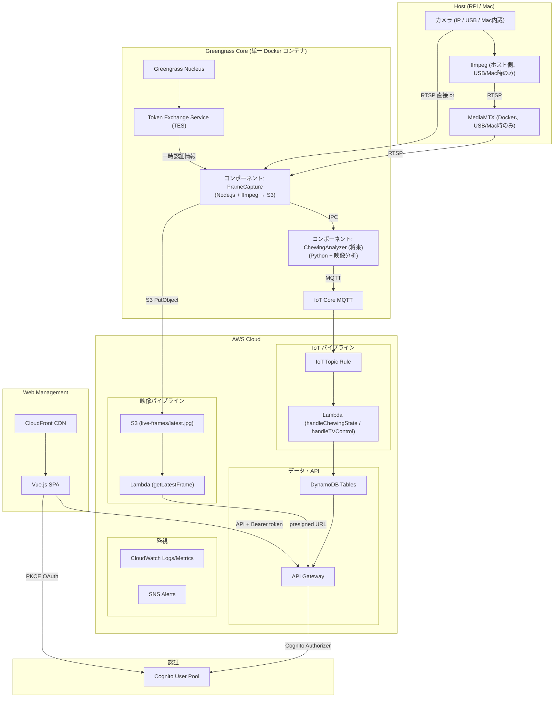

# Design Document

## Overview

NoEatToStopシステムは、エッジコンピューティングとクラウドベースの映像認識を組み合わせたハイブリッドアーキテクチャを採用する。Raspberry Pi 上の単一 Docker コンテナ（IoT Greengrass Core）内で、フレームキャプチャ・映像処理・IoT Core 連携を Greengrass カスタムコンポーネントとして統合実行する。RPi 3B のリソース制約（1GB RAM、7GB ディスク）に対応するため、Docker コンテナ数を最小化し、Greengrass の OTA デプロイ・TES 認証・ライフサイクル管理を活用する。

システムは以下の3つの主要コンポーネントで構成される：
1. **エッジデバイス層**: Docker + IoT Greengrass Core + カスタムコンポーネント（FrameCapture 等）+ カメラ
2. **クラウド処理層**: S3 + IoT Core MQTT + Lambda + DynamoDB
3. **管理・制御層**: Vue.js SPA + CloudFront + S3

## Architecture

### 全体アーキテクチャ



### Docker コンテナ構成（案 B: Greengrass 統合）

RPi 3B のリソース制約に対応するため、Edge 処理を単一 Greengrass コンテナに統合する。

```
[Greengrass Core コンテナ] (Debian bullseye-slim + Java 11 + Node.js 22 + Python 3.9 + OpenCV 4.5 + ffmpeg)
  ├── Greengrass Nucleus（コア・ライフサイクル管理）
  ├── Token Exchange Service（TES: AWS 一時認証情報の自動取得）
  ├── コンポーネント: com.noeatstop.FrameCapture
  │     Node.js + ffmpeg: RTSP → 1フレーム取得 → /tmp/frame.jpg → S3 PutObject
  │     認証: TES 経由（.env の AWS_ACCESS_KEY_ID 不要）
  │     設定: RTSP_URL, CAPTURE_INTERVAL, S3_BUCKET
  ├── コンポーネント: com.noeatstop.ChewingAnalyzer
  │     Python 3.9 + OpenCV: /tmp/frame.jpg 監視 → 顔検出 → 口領域差分 → 咀嚼判定
  │     → BB付き画像を S3 live-frames/latest-analyzed.jpg にアップロード
  │     → 状態変化時にエビデンス画像を S3 evidence/ にアップロード
  ├── コンポーネント: 将来追加予定（TVController 等）
  └── IoT Core MQTT 接続

[MediaMTX コンテナ] (USB カメラ / Mac 開発時のみ)
  RTSP リレーサーバー
```

| 構成 | コンテナ数 | 用途 |
|------|-----------|------|
| RPi + IP カメラ | **1** (greengrass-core のみ) | 本番構成 |
| RPi + USB カメラ | **2** (greengrass-core + mediamtx) | USB カメラ使用時 |
| Mac 開発 | **2** (greengrass-core は不使用、mediamtx + frame-capture) | 開発用（※Mac では Greengrass 不可） |

#### B案の実装スコープと境界（2026-03-20 E2E PASS で完了）

B案は Edge インフラの統合改善であり、以下が対象：
- FrameCapture を Greengrass Core 単一コンテナに統合（338MB イメージ）
- Edge → S3 フレームアップロード
- Edge → IoT Core MQTT Publish（到達確認まで）
- GG Nucleus + TES + FrameCapture プロセスの統合実行

**B案で未実装（C案スコープ）**:
- S3 Event Notification（フレームアップロード → Lambda 自動トリガー）
- IoT Topic Rule（MQTT → DynamoDB/Lambda 自動アクション）
- TV 制御コンポーネント

**C案 Phase 1 実装済み（ChewingAnalyzer）**:
- ChewingAnalyzer コンポーネント（OpenCV Haar Cascade 顔検出 + 口領域差分 + 咀嚼判定）
- 毎フレーム BB 付き分析画像を S3 `live-frames/latest-analyzed.jpg` にアップロード
- 管理画面で生フレーム/分析フレーム切替表示（`/video/latest-analyzed-frame` API）
- Edge E2E テスト 10/10 PASS

**C案 Phase 2 実装済み（MQTT → DynamoDB）**:
- ChewingAnalyzer が状態変化時に MQTT で `noeatstop/{deviceId}/chewing-state` に JSON publish
- IoT Topic Rule → Lambda `handleChewingState` → DynamoDB `ChewingStates` テーブルに保存
- DynamoDB TTL（`expiresAt`）で自動削除。保管日数は SystemSettings `chewingStateRetentionDays`（デフォルト7日）
- Edge E2E テスト 12/12 PASS

**C案で未実装**:
- S3 Event Notification（フレームアップロード → Lambda 自動トリガー）
- TV 制御コンポーネント（TVController）

### ライブ映像フロー

RTSP ストリームから定期的にフレームをキャプチャし、S3 + presigned URL で管理画面に配信する。リアルタイムストリーミングではなく、数秒間隔の静止画フレーム更新方式。

RPi 本番環境では、FrameCapture が Greengrass カスタムコンポーネントとして Greengrass Core コンテナ内で動作する。認証は TES（Token Exchange Service）経由で自動取得。

```
ライブ映像の動作フロー（RPi 本番: IP カメラ）
=============================================

[IP Camera]              [Greengrass Core コンテナ]              [AWS Cloud]              [Browser]
     |                              |                               |                       |
     |                   FrameCapture コンポーネント                  |                       |
     |<--- RTSP 接続 --------------|                               |                       |
     |--- RTSP ストリーム --------->|                               |                       |
     |                    1. ffmpeg -frames:v 1                     |                       |
     |                       (RTSP → JPEG)                          |                       |
     |                              |                               |                       |
     |                    2. TES → 一時認証情報取得                   |                       |
     |                              |--- 3. S3 PutObject ---------->|                       |
     |                              |    live-frames/latest.jpg     |                       |
     |                              |     (CAPTURE_INTERVAL秒ごと)   |                       |
     |                              |                               |                       |
     |                              |                               |    4. GET /video/     |
     |                              |                               |<--- latest-frame -----|
     |                              |                      Lambda: getLatestFrame            |
     |                              |                      S3 presigned URL生成 (60秒有効)    |
     |                              |                               |--- 5. {url: "..."} -->|
     |                              |                               |    6. GET presigned   |
     |                              |                               |<--- URL (S3直接) -----|
     |                              |                               |--- 7. JPEG 画像 ----->|
     |                              |                               |    8.  表示      |
     |                              |                               |     (定期リフレッシュ)   |
```

### S3 ストレージ構造

```
noeatstop-videos-{stage}-{account}/
├── live-frames/                   ← ライブ映像フレーム (1日で自動削除)
│   ├── latest.jpg                 ← 最新フレーム (FrameCapture が上書き更新)
│   └── latest-analyzed.jpg        ← BB付き分析フレーム (ChewingAnalyzer が上書き更新)
├── evidence/                      ← 検出エビデンス (1日で自動削除)
│   └── YYYY-MM-DD/
│       └── {event_type}_{HHMMSS}.jpg  ← 状態変化時の顔BB+口領域付き画像
└── daily/                         ← 食事セッション映像 (1日で自動削除)
    └── YYYY-MM-DD/
        └── session-{sessionId}/
            ├── raw-video.mp4
            ├── analysis-frames/
            └── metadata.json
```

### 認証アーキテクチャ（Cognito + PKCE）

```
認証フロー（Authorization Code Flow with PKCE）
=================================================

[Browser]                    [Cognito]                    [API Gateway]
    |                            |                             |
    |  1. 管理画面アクセス（未認証）  |                             |
    |--- router guard 検出 ----->|                             |
    |                            |                             |
    |  2. /oauth2/authorize      |                             |
    |--- (code_challenge) ------>|                             |
    |                            |                             |
    |  3. Managed Login 画面表示  |                             |
    |<--- Login UI --------------|                             |
    |                            |                             |
    |  4. 認証情報入力 + 送信     |                             |
    |--- email/password -------->|                             |
    |                            |                             |
    |  5. /callback?code=xxx     |                             |
    |<--- redirect --------------|                             |
    |                            |                             |
    |  6. /oauth2/token          |                             |
    |--- (code + verifier) ----->|                             |
    |                            |                             |
    |  7. access/id/refresh token|                             |
    |<--- tokens ----------------|                             |
    |                            |                             |
    |  8. API リクエスト          |                             |
    |--- Authorization: Bearer --|------ Cognito Authorizer -->|
    |                            |       トークン検証            |
    |  9. API レスポンス          |                             |
    |<--- data ------------------|------- Lambda 実行 ---------|
```

- **User Pool**: `noeatstop-users-{stage}`, selfSignUp 無効, email サインイン
- **App Client**: PKCE（generateSecret: false）, Authorization Code Grant, scopes: openid/email/profile
- **Domain**: Cognito Managed Login（`noeatstop-{stage}.auth.{region}.amazoncognito.com`）
- **Authorizer**: CognitoUserPoolsAuthorizer、全14 API メソッドに適用
- **トークン保存**: access_token / refresh_token → localStorage、code_verifier → sessionStorage
- **トークン有効期限**: access_token 1時間、refresh_token 30日

## Components and Interfaces

### 1. Edge Device Components

#### IoT Greengrass Core (単一 Docker コンテナ)
- **責任**: Edge 全機能の統合実行環境
- **技術**: AWS IoT Greengrass V2（Docker コンテナ）
- **ベースイメージ**: Debian bullseye-slim + Java 11 + Node.js 22 + Python 3.9 + ffmpeg
- **実行環境**: docker-compose で管理。RPi 3B のリソース制約に対応するため単一コンテナに統合
- **機能**:
  - Greengrass カスタムコンポーネントの実行・ライフサイクル管理
  - TES（Token Exchange Service）による AWS 一時認証情報の自動取得
  - OTA（Over-The-Air）によるコンポーネントのリモート更新
  - デバイス証明書による IoT Core 認証
  - IoT Core 経由での MQTT Publish/Subscribe
  - IPC（プロセス間通信）によるコンポーネント間連携

#### Greengrass コンポーネント: com.noeatstop.FrameCapture
- **責任**: RTSP ストリームからのフレームキャプチャと S3 アップロード
- **技術**: Node.js 22 + ffmpeg（Greengrass コンテナ内で実行）
- **認証**: TES 経由で S3 への一時認証情報を自動取得（.env の AWS_ACCESS_KEY_ID 不要）
- **処理フロー**:
  1. RTSP ストリームに接続（IP カメラ直接 or MediaMTX 経由）
  2. ffmpeg で 1 フレーム取得（JPEG）
  3. S3 PutObject で `live-frames/latest.jpg` にアップロード
  4. `CAPTURE_INTERVAL` 秒待機して繰り返し
- **コンポーネント設定**（Greengrass デプロイメント設定で管理）:
  - `rtspUrl`: RTSP ソース URL（デフォルト: `rtsp://mediamtx:8554/camera`）
  - `s3Bucket`: S3 バケット名
  - `captureInterval`: キャプチャ間隔秒数（デフォルト: 3）
  - `awsRegion`: AWS リージョン（デフォルト: `ap-northeast-1`）
- **ライフサイクル**（recipe.yaml で定義）:
  - Install: `npm install --omit=dev`
  - Run: `node capture.js`（Greengrass が自動起動・再起動管理）
- **エラーハンドリング**: キャプチャ失敗時はログ出力して次サイクルで再試行

#### Greengrass コンポーネント: com.noeatstop.ChewingAnalyzer
- **責任**: エッジでの映像分析と咀嚼状態判定
- **技術**: Python 3.9 + OpenCV 4.5（apt python3-opencv）+ boto3
- **連携方式**: FrameCapture が `/tmp/frame.jpg` に書き出し → ChewingAnalyzer がファイル更新を検知して分析
- **咀嚼判定ロジック**:
  1. **顔検出**: OpenCV Haar Cascade（`haarcascade_frontalface_default.xml` 同梱）。`scaleFactor=1.3`, `minNeighbors=5`, `minSize=(60,60)`。複数顔検出時は最大面積を使用
  2. **口領域抽出**: 顔矩形の下部 30%（`MOUTH_ROI_RATIO`）を口領域と仮定（顔ランドマーク未使用）
  3. **差分計算**: 前フレームと現フレームの口領域を `cv2.absdiff` → `np.sum` でピクセル差分量を算出
  4. **咀嚼判定**: 直近 `ANALYSIS_FRAME_COUNT=5` フレームの平均差分量が `CHEWING_MOTION_THRESHOLD=500` 超 → chewing
  5. **状態遷移**: `waiting` → `chewing` / `chewing_stopped` / `meal_ended`
- **S3 アップロード**:
  - **毎フレーム**: BB付き画像を `live-frames/latest-analyzed.jpg` に上書き（管理画面表示用）
  - **状態変化時**: エビデンス画像を `evidence/{date}/{event_type}_{time}.jpg` にアップロード
- **BB 表示**:
  - 顔矩形: 状態色（緑=chewing、黄=stopped、赤=ended）
  - 口領域: 青枠
  - テキスト: 状態 + motion スコア（左上）
- **設定パラメータ**: `CHEWING_MOTION_THRESHOLD`, `FACE_DETECTION_SCALE`, `MOUTH_ROI_RATIO`, `ANALYSIS_FRAME_COUNT`, `PAUSE_THRESHOLD`
- **現在の限界**: 正面顔のみ（横顔不可）、口位置は固定比率推定、照明変化・カメラ揺れで誤検出の可能性あり

#### カメラ入力（ホスト側）
- **RTSP 接続パターン**:
  - **パターン A（MediaMTX 経由）**: USB カメラ / Mac 内蔵カメラ使用時。ホスト ffmpeg → MediaMTX (Docker) → FrameCapture
  - **パターン B（IP カメラ直接）**: `RTSP_URL` 設定時。FrameCapture が直接接続。MediaMTX 不要
- **カメラ配信スクリプト**:
  - Mac: `start-camera.sh`（avfoundation、640x480/30fps）
  - RPi: `start-camera-rpi.sh`（v4l2 + mjpeg）

#### TV Control Module
- **責任**: パナソニック製テレビ（2022年製50インチ）の電源制御
- **技術**: Smart TV API優先、Amazon Alexa音声制御も活用
- **制御方式**:
  - Smart TV API: HTTP REST API経由での直接制御
  - Alexa統合: 音声合成による日本語コマンド送信
  - リトライ設定: 1回リトライ、3秒間隔
- **インターフェース**: 
  ```python
  def control_tv(action: str) -> bool:
      # Smart TV API試行
      if smart_tv_api_control(action):
          return True
      
      # Alexa音声制御フォールバック
      return alexa_voice_control(f"テレビを{action}")
  ```

### 2. Cloud Processing Components

#### IoT Topic Rule → Lambda → DynamoDB パイプライン
- **責任**: Edge からの MQTT メッセージをクラウド側で永続化
- **処理フロー**:
  1. ChewingAnalyzer / DeviceController が MQTT publish
  2. IoT Topic Rule がメッセージをフィルタ
  3. Lambda が DynamoDB に保存（TTL 付き）
- **トピック**: `noeatstop/{deviceId}/chewing-state`, `noeatstop/{deviceId}/tv-control`

#### S3 Event → Lambda → DynamoDB パイプライン
- **責任**: フレームアップロード時にメタデータを自動記録
- **処理フロー**: S3 `frames/` prefix に PutObject → Lambda `handleFrameUpload` → FrameHistory テーブル

#### API Lambda Functions (14個)
- **責任**: 管理画面からの CRUD 操作
- **認証**: 全メソッド CognitoUserPoolsAuthorizer で保護
- **主要エンドポイント**: meal-session, eating-state, settings, video/latest-frame, chewing-states, tv-control, frame-history, labels

### 3. Data Management Components

#### DynamoDB Tables
- **MealSessions**: 食事セッション管理
  ```json
  {
    "sessionId": "string",
    "startTime": "timestamp",
    "endTime": "timestamp",
    "status": "active|completed",
    "eatingDuration": "number",
    "pauseCount": "number"
  }
  ```

- **EatingStates**: 食事状態履歴
  ```json
  {
    "sessionId": "string",
    "timestamp": "timestamp",
    "state": "eating|not_eating|ended",
    "confidence": "number",
    "analysisSource": "edge|bedrock"
  }
  ```

- **SystemSettings**: システム設定
  ```json
  {
    "settingKey": "string",
    "settingValue": "string",
    "lastUpdated": "timestamp"
  }
  ```

#### S3 Storage Structure
```
noeatstop-videos-{stage}-{account}/       ← 映像用バケット
├── live-frames/                          ← ライブ映像 (lifecycle: 1日で削除)
│   └── latest.jpg                        ← frame-capture が上書き更新
└── daily/                                ← セッション映像 (lifecycle: 1日で削除)
    └── YYYY-MM-DD/
        └── session-{sessionId}/
            ├── raw-video.mp4
            ├── analysis-frames/
            └── metadata.json

noeatstop-webapp-{stage}-{account}/       ← フロントエンド用バケット
├── index.html
├── vite.svg
└── assets/
    ├── index-*.js
    ├── index-*.css
    ├── LiveVideo-*.js
    └── ...
```

### 4. Web Management Interface

#### Vue.js SPA Architecture
- **技術スタック**: Vue 3 + Composition API + Tailwind CSS
- **状態管理**: Pinia
- **ルーティング**: Vue Router
- **HTTP Client**: Axios

#### Deployment Architecture
- **S3 Static Hosting**: Vue.jsアプリケーションの静的ファイルホスティング
- **CloudFront CDN**: グローバル配信とSPA対応（404→index.html）
- **自動デプロイ**: CloudFormationからAPI URL取得、環境変数設定、ビルド、S3アップロード
- **デプロイスクリプト**: 
  - `npm run deploy`: インフラストラクチャのみ
  - `npm run deploy:frontend`: フロントエンドのみ
  - `npm run deploy:all`: 統合デプロイ

#### Component Structure
```
src/
├── components/
│   ├── AuthCallback.vue       # OAuth callback ページ（認証コード → トークン交換）
│   ├── LiveVideo.vue          # ライブ映像表示（presigned URL で S3 フレーム取得、定期更新）
│   ├── MealHistory.vue        # 食事履歴・統計（咀嚼時間、TV制御回数）
│   ├── SystemSettings.vue     # システム設定（全パラメータ設定変更）
│   ├── Dashboard.vue          # ダッシュボード
│   ├── EmergencyControl.vue   # 手動停止・緊急制御
│   ├── ErrorAnalysis.vue     # 誤判定フラグ入力・分析
│   └── TVControlStatus.vue   # TVコントロール状態表示・監視
├── stores/
│   ├── authStore.ts          # 認証状態管理（Cognito OAuth）
│   ├── mealStore.ts          # 食事データ管理
│   ├── settingsStore.ts      # 設定管理（全パラメータ対応）
│   └── tvControlStore.ts     # TVコントロール状態管理
├── router/
│   └── index.ts              # ルーティング + 認証ガード（beforeEach）
└── services/
    ├── authService.ts        # PKCE 生成、Cognito OAuth フロー、トークン管理
    ├── apiService.ts         # API通信（Bearer token 自動付与 + 401 リフレッシュ）
    └── ...
```

## Data Models

### Core Data Entities

#### MealSession
```typescript
interface MealSession {
  sessionId: string;
  startTime: Date;
  endTime?: Date;
  status: 'active' | 'completed' | 'interrupted';
  totalDuration: number; // 総食事時間（秒）
  chewingDuration: number; // 実際の咀嚼時間（秒）
  chewingStopCount: number; // 咀嚼停止によるTV制御回数
  averageConfidence: number;
  videoS3Key: string;
  childrenCount: number; // セッション中の子供数
  performanceMetrics: {
    mealStartDetectionTime: number; // 食事開始検出時間
    mealEndDetectionTime: number; // 食事終了検出時間
    faceDetectionAccuracy: number; // 顔検出精度
    mouthDetectionAccuracy: number; // 口検出精度
    chewingDetectionAccuracy: number; // 咀嚼検出精度
    tvControlSuccessRate: number; // TV制御成功率
  };
}
```

#### EatingState
```typescript
interface EatingState {
  sessionId: string;
  timestamp: Date;
  state: 'chewing' | 'chewing_stopped' | 'meal_ended';
  confidence: number; // 0.0 - 1.0
  analysisSource: 'edge' | 'bedrock';
  metadata: {
    faceDetected: boolean;
    mouthPosition: { x: number, y: number };
    chewingDetected: boolean;
    chewingDuration: number; // 継続時間（秒）
    tvStatus: 'on' | 'off';
    childrenDetected: number; // 検出された子供数
    adultsDetected: number; // 検出された大人数（除外設定時）
  };
  errorFlag: boolean; // 誤判定フラグ（手動入力）
  imageS3Key?: string; // 判定時の画像保存先
  videoS3Key?: string; // 判定時の動画保存先
}
```

#### SystemConfiguration
```typescript
interface SystemConfiguration {
  // 基本設定
  pauseThreshold: number; // 動作停止閾値（デフォルト10秒）
  confidenceThreshold: number; // 信頼度閾値（デフォルト80%）
  videoBufferDuration: number; // 映像バッファ時間（デフォルト10秒）
  analysisVideoDuration: number; // 判定用映像時間（デフォルト20秒）
  videoRetentionDays: number; // 映像保持期間（デフォルト1日）
  
  // 映像設定
  videoResolution: string; // 解像度（デフォルト640x360）
  videoFrameRate: number; // フレームレート（デフォルト30fps）
  liveVideoUpdateInterval: number; // リアルタイム映像更新間隔（デフォルト3秒）
  
  // 認識設定
  faceDetectionThreshold: number; // 顔認識閾値
  mouthDetectionThreshold: number; // 口の位置認識閾値
  chewingDetectionThreshold: number; // 咀嚼判定閾値
  
  // 対象者設定
  childCount: number; // 監視対象の子供数
  excludeAdults: boolean; // 大人検出除外フラグ
  
  // 制御設定
  tvControlMethod: 'interface' | 'mock'; // TVコントロール方式
  tvControlRetryCount: number; // リトライ回数（デフォルト1回）
  tvControlRetryInterval: number; // リトライ間隔（デフォルト3秒）
  
  // システム設定
  enableEdgeProcessing: boolean;
  enableCloudProcessing: boolean;
  enableAnonymization: boolean; // 匿名化処理ON/OFF（UI表示のみ）
}

#### TVControlStatus
```typescript
interface TVControlStatus {
  sessionId: string;
  isRequesting: boolean; // リクエスト実行中フラグ
  lastRequest?: {
    sessionId: string;
    action: 'turn_off' | 'turn_on';
    timestamp: Date;
    reason: string;
  };
  lastResponse?: {
    sessionId: string;
    success: boolean;
    timestamp: Date;
    method: string;
    error?: string;
  };
  requestCount: number; // 総リクエスト回数
}
```

## Error Handling

### Edge Device Error Handling
1. **カメラ接続エラー**: 自動再接続とフォールバック処理
2. **ネットワーク断絶**: ローカル処理継続とデータキューイング
3. **TV制御エラー**: 複数制御方法の試行とログ記録

### Cloud Processing Error Handling
1. **MQTT 送信エラー**: IoT Core 接続リトライ
2. **S3 アップロードエラー**: 次サイクルで再試行
3. **DynamoDB書き込みエラー**: バッチ処理とデッドレターキュー

### Error Recovery Strategies
```python
class ErrorHandler:
    def handle_camera_error(self, error):
        # カメラ再初期化
        self.reinitialize_camera()
        
        # フォールバック: 前回の状態を維持
        return self.get_last_known_state()
    
    def handle_network_error(self, error):
        # ローカルキューに保存
        self.queue_for_later_upload(data)
        
        # エッジ処理のみで継続
        return self.process_locally_only()
```

## Testing Strategy

### Unit Testing
- **エッジ処理ロジック**: モックカメラデータでの単体テスト
- **クラウド処理関数**: Lambda関数の単体テスト
- **Web UI コンポーネント**: Vue Test Utils使用

### Integration Testing
- **エッジ-クラウド連携**: MQTT → IoT Topic Rule → Lambda → DynamoDB 統合テスト
- **API統合**: DynamoDB + S3 presigned URL の統合テスト
- **E2E テスト**: `edge/e2e-test.sh`（18項目）

### Performance Testing
- **映像処理レイテンシ**: エッジ処理時間の測定
- **クラウド応答時間**: API応答時間の監視
- **システム全体スループット**: 1日の処理能力測定

### Test Data Management
```python
# テスト用映像データセット
test_scenarios = {
    "normal_eating": "child_eating_normally.mp4",
    "paused_eating": "child_distracted_by_tv.mp4", 
    "meal_finished": "child_finished_eating.mp4",
    "no_child_present": "empty_dining_room.mp4"
}
```

## Security Considerations

### 管理画面認証
- **Amazon Cognito User Pool**: セルフサインアップ無効、管理者招待のみ
- **Authorization Code Flow with PKCE**: SPA 向けセキュアな認証フロー（外部ライブラリ不使用）
- **Cognito Authorizer**: 全 API Gateway メソッドにトークン検証を適用
- **トークン管理**: access_token（1h）/ refresh_token（30d）を localStorage に保存、自動リフレッシュ

### Device Security
- IoT Greengrass証明書による認証
- エッジデバイスの物理セキュリティ
- 映像データの暗号化保存

### Cloud Security
- IAMロールによる最小権限アクセス
- VPC内でのリソース配置
- S3バケットの暗号化とアクセス制御

### Privacy Protection
- 映像データの自動削除（30日後）
- 個人識別情報の匿名化
- データアクセスログの監査